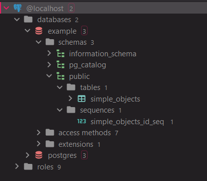
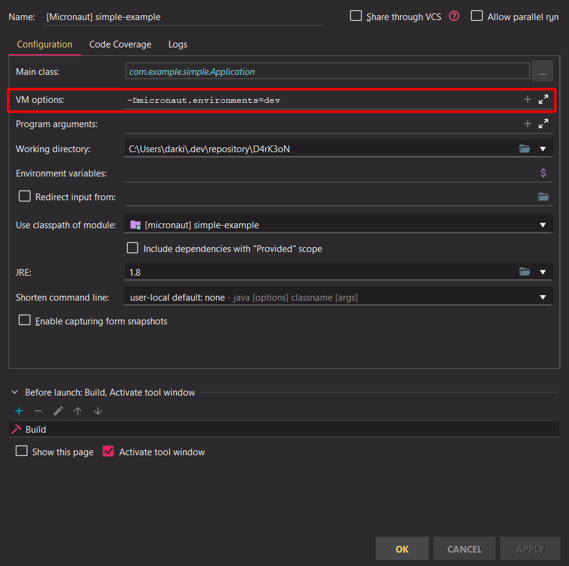

<!-- PROJECT SHIELDS -->
[](https://coveralls.io/github/D4rK3oN/ms-micronaut-demo?branch=master)
[![Contributors][contributors-shield]][contributors-url]
[![Forks][forks-shield]][forks-url]
[![Stargazers][stars-shield]][stars-url]
[![Issues][issues-shield]][issues-url]
[![LinkedIn][linkedin-shield]][linkedin-url]

<!-- LOGO -->
<br />
<p align="center">
  <a href="https://github.com/D4rK3oN/ms-micronaut-demo">
    
  </a>

  <h3 align="center">Microservices with Micronaut</h3>

  <p align="center">
    A basic demo of a microservice
  </p>
</p>

<!-- TABLE OF CONTENTS -->
## Table of Contents

* [About the Project](#about-the-project)
* [Getting Started](#getting-started)
  * [Prerequisites](#prerequisites)
  * [Installation](#installation)
* [Roadmap](#roadmap)

<!-- ABOUT THE PROJECT -->
## About The Project

This project is a PoC on how to create a basic microservice with Micronaut.

<!-- GETTING STARTED -->
## Getting Started

Here are some instructions on how to configure your project locally.
<br />
To get a local copy up and running follow these simple steps.

### Prerequisites

This is a list things that you need to use the software and how to configure them.
* PostgreSQL Database (optional)
    * We can download the Community Server from their [website](https://www.postgresql.org/download)
    * A good alternative to installing a PostgreSQL Database is create a PostgreSQL container in Docker.

* Docker Desktop
    * The software can be download from their [website](https://www.docker.com/products/docker-desktop)

```sh
# Create volumes in docker to save data (optional)
docker volume create postgre-vol
docker volume create microservices-vol

# Download and run PostgreSQL container
docker pull postgres
docker run -d -p 5432:5432 -e POSTGRES_PASSWORD=admin -v postgre-vol:/var/lib/postgresql/data --name postgre-sql postgres
```

* Create the schema in PostgreSQL
    * Once the PostgreSQL is installed, we must create the model that our microservice will use.
      <br />
      <br />
      <i>This is an example of how it should look:</i>

      <p align="center">
        
      </p>

      <i>And these are the SQL queries that I ran to mount my DB:</i>

```postgresql
create database example;

create table public.simple_objects
(
    id       serial not null,
    name     varchar(120),
    nickname varchar(60),
    email    varchar(240),
    age      integer,
    constraint simple_objects_pk
        primary key (id)
);

alter table public.simple_objects
    owner to postgres;

create unique index simple_objects_id_idx
    on public.simple_objects (id);

INSERT INTO public.simple_objects (id, name, nickname, email, age) VALUES (1, 'Neena Thurman', 'Domino', 'domino@xforce.com', null);
INSERT INTO public.simple_objects (id, name, nickname, email, age) VALUES (2, null, 'Cable', null, null);
INSERT INTO public.simple_objects (id, name, nickname, email, age) VALUES (3, null, 'Psylocke', null, null);
INSERT INTO public.simple_objects (id, name, nickname, email, age) VALUES (4, null, 'Colossus', null, null);
INSERT INTO public.simple_objects (id, name, nickname, email, age) VALUES (5, 'Wade Winston Wilson', 'Deadpool', 'deadpool@xforce.com', 28);
```

### Installation

#### Execute with docker
```sh
docker pull d4rk3on/ms-micronaut-demo:{version}
docker run -d -p 9081:9081 -e DEV_PATH='/' -e MICRONAUT_ENVIRONMENTS='docker' -v microservices-vol:/resources --link postgre-sql --name micronaut-demo d4rk3on/ms-micronaut-demo:{version}
```

#### Execute without docker
1. Clone the repository
```sh
git clone https://github.com/D4rK3oN/ms-micronaut-demo.git
```

2. Configure environment variables  
Add DEV_PATH var with the path where you want to save the logs, etc
```xml
<!-- e.g. used in logback.xml -->
<file>${DEV_PATH}/resources/ms-micronaut-demo/logs/simple_example.log</file>
```

3. Configure the properties of the application-dev.yml file (if you need it)
```yml
datasources:
  default:
    url: jdbc:postgresql://localhost:5432/example
    username: postgres
    password: admin
```

4. Run/Debug the project with the profile "dev"
```text
VM options: -Dmicronaut.environments=dev
```

<p align="center">
    
</p>

<!-- ROADMAP -->
## Roadmap

See the [open issues](https://github.com/D4rK3oN/ms-micronaut-demo/issues) for a list of proposed features (and known issues).

<!-- MARKDOWN LINKS & IMAGES : https://www.markdownguide.org/basic-syntax/#reference-style-links -->
[contributors-shield]: https://img.shields.io/github/contributors/D4rK3oN/ms-micronaut-demo.svg?style=flat-square
[contributors-url]: https://github.com/D4rK3oN/ms-micronaut-demo/graphs/contributors
[forks-shield]: https://img.shields.io/github/forks/D4rK3oN/ms-micronaut-demo.svg?style=flat-square
[forks-url]: https://github.com/D4rK3oN/ms-micronaut-demo/network/members
[stars-shield]: https://img.shields.io/github/stars/D4rK3oN/ms-micronaut-demo.svg?style=flat-square
[stars-url]: https://github.com/D4rK3oN/ms-micronaut-demo/stargazers
[issues-shield]: https://img.shields.io/github/issues/D4rK3oN/ms-micronaut-demo.svg?style=flat-square
[issues-url]: https://github.com/D4rK3oN/ms-micronaut-demo/issues
[linkedin-shield]: https://img.shields.io/badge/-LinkedIn-black.svg?style=flat-square&logo=linkedin&colorB=555
[linkedin-url]: https://www.linkedin.com/in/javier-moreno-alvarez